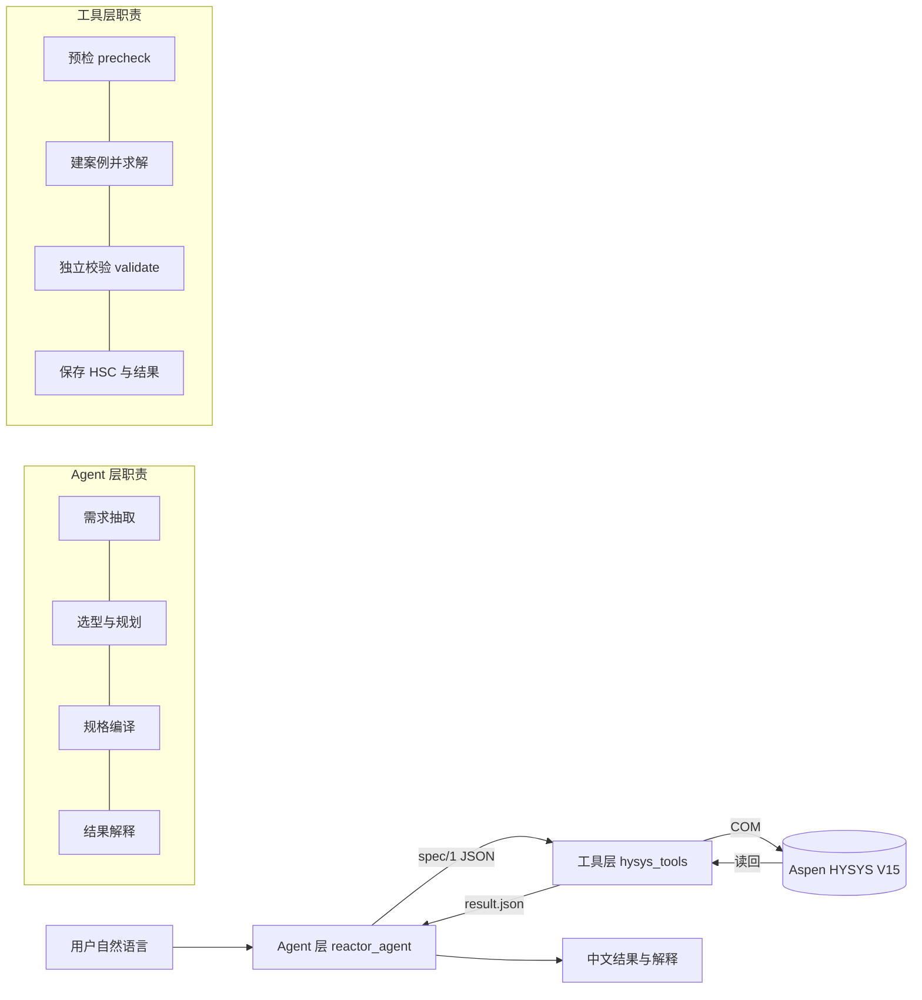
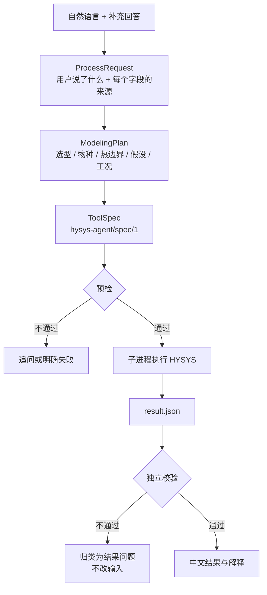
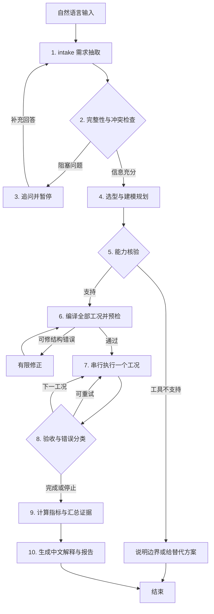

# 项目计划说明

> 本文取代 `AGENT_IMPLEMENTATION_PLAN.md` 的实施部分；那份文档保留为**规划时的检查记录**，
> 其中列出的问题大多已经修复，逐条对照见其第 10 节。
> 本文描述**从现在起怎么做完**。

日期：2026-10-02
目标：完成「自然语言 → 自主选型 → HYSYS 建模 → 校验 → 中文结果」的闭环，并交付全部材料。

---

## 1. 与评分标准的对应

| 评分维度 | 权重 | 依靠什么拿分 | 当前状态 |
|---|---|---|---|
| 系统完成度 | 50% | 自然语言入口；三个场景在 HYSYS 中真实运行；结果准确 | 工具层真机验收通过；**自然语言入口已完成**（甲苯/重整编译到可执行规格，气化正确拒绝）；真机上的 Agent 端到端待跑 |
| 探索与系统设计 | 25% | 报告与 Live Demo 讲清选型、架构、遇到的问题及解决过程 | `REPORT.md` 已成文；设计文档齐备 |
| AI 协作质量 | 25% | 开发速度与 AI 使用记录 | 有完整对话记录，**待导出** |

**一句话**：工具层（HYSYS 联动）已真机验收；自然语言入口到"可执行规格"这一段
已全线打通并有 339 项离线测试；剩下的是在真机上跑一次完整链路，以及整理交付物。

---

## 2. 当前状态

### 2.1 已完成并有真机证据

**工具层 `hysys_tools/`** —— 已通过远程真机验收：

```
run_id  acceptance-20261002-144131-d442afae   (远程 Python 3.12.4 / Windows 19045)
status  BASELINE_PASS_GASIFICATION_STILL_BLOCKED
```

| 工况 | 反应器 | 结果 | 与历史基线 |
|---|---|---|---|
| 甲苯歧化 10000 kg/h、380°C、2.5 MPa | Conversion 绝热 | 转化率 49.99999999999999% | 逐位相同 |
| 重整 710°C | Gibbs 等温 | CH₄ 54.035809%、H₂ 1942.812 kmol/h | 逐位相同 |
| 重整 600°C | Gibbs 等温 | CH₄ 30.352385%、H₂ 1163.670 kmol/h | 逐位相同 |
| 水煤浆气化（原题输入） | — | 预检拒绝，未创建案例 | 按设计 |

证据：`tool-layer-runs/acceptance-20261002-144131-d442afae/`（45 个文件，含各工况
`result.json`、`steps.json`、健康检查与远程代码哈希）。

**Agent 层 `reactor_agent/`** —— 自然语言入口已完成：

| 模块 | 职责 |
|---|---|
| `schemas.py` | 三层数据契约（`ProcessRequest` / `ModelingPlan` / `OperatingCase`）|
| `capabilities.py` | 组合级能力查询 |
| `selection.py` | 选型规则（题目第 8 节）|
| `compiler.py` | 规格编译（`ModelingPlan` → `hysys-agent/spec/1`）|
| `llm.py` | 模型客户端：降级链、主动控速、`enable_thinking: false`、凭据不入文件 |
| `extraction.py` | 模型侧契约（扁平数组化）+ **防幻觉检查** |
| `normalize.py` | 确定性归一化（单位、组分名、反应式、组成、工况）|
| `pipeline.py` | 单遍流程：抽取 → 归一化 → 选型 → 编译 → 预检 → 执行 |
| `graph.py` | LangGraph 主图装配、SQLite 检查点、产物输出 |
| `nodes/` | 每个阶段一个模块：`intake` / `plan` / `ask` / `execute` / `explain` / `state` / `answers`。**追问与副作用分离**，`execute` 是唯一有副作用的节点 |
| `adapters/` | 子进程执行工具层 + 执行台账（避免重复运行）|
| `__main__.py` | CLI 入口（默认 dry run，`--execute` 才驱动 HYSYS）|

**端到端验证**（真实模型调用，本机无 HYSYS 故止于预检）：

| 场景 | 结果 |
|---|---|
| 甲苯 | `READY`，规格通过预检，元素守恒 |
| 重整 | `READY`，两个工况各自通过预检；自动记录假设（进料流量 1370.37 kmol/h）|
| 气化 | `WAITING_INPUT`，未创建任何案例，列出待澄清问题 |

**开发环境** —— `conda` 环境 `hysys-agent`，Python 3.12.15（与远程同大版本），
依赖锁定于 `requirements.txt`。

**模型服务** —— `qwen3.7-flash`，`enable_thinking: false`（见第 4 节）。

**测试规模** —— **403 项全部通过**：工具层 144（110 selfcheck + 34 reliability）
+ Agent 层 195（llm 23、extraction 22、normalize 33、selection 18、compiler 23、
adapters 30、pipeline 23、graph 23）+ 打包器 17。

### 2.2 未完成

| 项 | 说明 |
|---|---|
| **真机上的 Agent 端到端** | 本机无 HYSYS，Agent 层验证到"规格通过预检"为止。适配器/台账/暂停恢复都有离线测试，但未在真实工作站跑过完整链路 |
| P0-E 气化闭环 | 阻塞于题目信息（80000 Nm³/h 基准、煤定义）；未澄清前保持拒绝，这是设计行为 |
| P1-F 图形界面 | 目前是 CLI（`python -m reactor_agent`）|
| P1-G 交付物 | 报告已成文；Git 仓库、README 定稿、录屏、AI 对话导出待完成 |

---

## 3. 系统架构

### 3.1 两层分工



**分界的意义**：模型只产出 `ModelingPlan`。任何模型生成的内容要变成 COM 调用、
文件路径或子进程参数，都必须先经过 `compiler.py` 和 `precheck.py` 的确定性检查。

### 3.2 三层数据契约



**三层分开的理由**：`ProcessRequest` 允许字段缺失（缺失本身就是"要提问"的信号）；
`ModelingPlan` 记录工程判断；`ToolSpec` 是严格可执行的。把"用户说了什么"和
"我们决定怎么建模"混在一起，正是旧选型草稿出问题的地方。

### 3.3 Agent 主图



**路由原则**：重试预算耗尽或预检不可修复时，结束为失败或待澄清；某个工况失败
时保留其他已成功结果，整体返回 `PARTIAL`，**不把缺失工况补成预测值**。

### 3.4 最终任务状态

```
WAITING_INPUT  等用户回答阻塞问题（HYSYS 调用次数必须为 0）
READY          规格已编译并通过预检
RUNNING        正在执行
PASS           阻塞问题清空 + 工具成功 + 结果通过验收 + 证据文件可用
PARTIAL        部分工况成功，其余失败（不补预测值）
FAILED         失败
UNSUPPORTED    正确的模型但工具无法执行（保留选型，不篡改）
```

---

## 4. 技术选型与理由

| 选择 | 理由 | 验证状态 |
|---|---|---|
| **COM + pywin32** 直连 HYSYS | 唯一能在不依赖 GUI 录制的前提下真实建模的路径；已用 8 个真机坑换来完整调用序列 | ✅ 真机验收通过 |
| **JSON spec 作为层间契约** | 让模型只表达意图，不触碰 COM；使离线预检成为可能 | ✅ |
| **pydantic** | 三层契约带类型校验；**内部**契约用完整模型，**给模型**的契约另行简化（见 4.1） | ✅ 已集成 |
| **标准库 + 无第三方** 的工具层 | 离线测试在无 HYSYS、无 pywin32 的机器上也能跑 | ✅ 144 项 |
| **LangGraph** | 主流程需要显式状态与暂停/恢复（追问后继续），不是自由 Agent 循环 | ⏳ 待 P0-C 接入 |
| **模型服务：基元律动** | 见下 | ✅ 已实测 |
| **失败不静默降级** | Equilibrium 走不通就拒绝，PFR 没实现就报 UNSUPPORTED | ✅ |

### 4.1 模型服务（已实测）

```
Base URL   https://tokenrhythm.studio/v1
端点       POST /chat/completions
模型       qwen3.7-flash   调用参数 enable_thinking=false
凭据       运行时从环境变量读入（TR_BASE / TR_KEY），不写入任何文件
```

实测结论（`scripts/probe_llm.py`、`scripts/bench_llm.py`，结果落在 `_demo/`）：

| 能力 | 结果 |
|---|---|
| `GET /models` | 200，**23 个模型** |
| 普通对话 | 200，1.3–3.2 s |
| `response_format: json_object` | 200，输出可解析 |
| `response_format: json_schema` | 200，服务端接受 pydantic 生成的 schema |

**最重要的结论是"模型边界契约要小而扁平"，而不是"schema 能过就行"。**

第一版把完整的 `ProcessRequest` schema 交给模型，结果它输出**键名乱码**：

```json
"stoichiometry": { ": ": -2 },
"flows": { ": {": 10000, "": 380, ":-2.5MPa,65900-6700": -1 }
```

因为 `dict[str, float]` 在 JSON Schema 里是 `additionalProperties`——**开放字典**，在
`strict` 模式下模型必须自己发明键名。改成**数组**后结构立即正确：

```
stoichiometry: dict[str, float]  ->  species: [{name, coefficient}]
fractions: dict[str, float]      ->  [{name, fraction}]
```

另外两条同样来自实测：

1. **要求模型"照抄"，不要归一化** —— 明确写 copy numbers and units EXACTLY as written。
   基准里一个候选把 `50%` 读成 `0.5`，另一个把 `62wt%` 当成转化率。
2. **给它 `missing_information` 数组** —— 让"不编造"成为它可以**主动做**的事，而不是
   必须记住**不要做**的事。实测模型会自己列出"Nm3/h 的标准状态需要确认"。

**归一化属于确定性代码**（`compiler.py` / `precheck.py`）：`"度"`/`"℃"` → `C`、
`100` → `1.0`、组分名 → HYSYS 库名。

**服务端行为**（影响客户端设计）：并发 10 个以上会 `429 RATE_LIMITED`，偶发
`503 LITELLM_UNAVAILABLE`，所以**必须串行 + 退避重试**；部分模型是推理模型，
`max_tokens` 不足时 **`content` 为空但 HTTP 200**（`deepseek-flash` 需要 4000–8000
token 才吐 42–47 字，耗时 27–47 秒）。

**模型与调用配置**：需求方确定使用 **qwen3.7-flash**。随后实测发现**关掉推理**
（enable_thinking: false）让同一模型**又快又准**——从 0.80 / 24.5 秒变成
**0.87 / 3.6 秒**（甲苯三轮全对）。原理是推理把 token 预算吃光后**输出被截断**，
所以想得多反而答得少。

**三项与模型无关、必须保留的机制**：

1. **强化提示词** —— 加一句题目给出的数值留空是错误，准确率 78% → 89%。
2. **字段名覆盖原文语义** —— 补 case_pressures 后，13.5 bar 才能被提取到；
   在此之前模型**无处安放**这个值（原文的压力是工况压力，不是进料压力），只能丢成 null。
3. **必填字段校验后重试，且必填项按场景配置** —— 见下面的教训。

> **踩过的坑（值得写进报告）**：一开始对所有场景用同一组必填字段，结果重整被判
> 「全字段缺失」。原因是 **Gibbs 反应器本来就不需要 conversion_percent**，而题目说
> 进料流量可以自定，所以 eed_total 为空**也是对的**。
> **校验规则必须反映场景语义，否则会把正确行为判成失败。**

**气化场景不计入模型评分**：该题本身信息不足（未给 Nm3/h 的基准与所指流股、未给煤
的组成），模型填不全是正确行为。系统对该场景的判据是"是否原样保留 `Nm3/h` 而不擅自
换算"，以及规则层是否生成阻塞问题。详见 [TECH_STACK.md](TECH_STACK.md) 第 4.4 节。

**凭据纪律**（用户明确要求，且导出对话时会泄露）：

- 只从环境变量读，**不写入代码、配置、日志或 checkpoint**
- 本地开发用 `$env:TR_BASE` / `$env:TR_KEY` 临时设置
- 演示结束**轮换或作废该 key**；导出 AI 对话记录前先脱敏

---

## 5. 分阶段计划

### P0-C：自然语言主图 + 甲苯闭环（当前阶段，最高优先）

**产出**

1. `reactor_agent/llm.py` —— 模型客户端
   - 从环境变量读端点、凭据、模型名（`TR_BASE` / `TR_KEY` / `TR_MODEL`）
   - **串行调用 + 退避重试**（并发会 429，服务端偶发 503）
   - 检测 `content` 为空（推理模型把预算用在 `reasoning_content` 上时会这样）
   - **必填字段校验后重试**（最多 3 次）：漏值是随机的，实测 83% 一次成功、
     100% 三次内完整，平均 1.33 次（约 3.7 秒）。**用快模型加校验重试，
     好过用慢模型跑一次**
   - 结构化错误返回（**失败不能让流程崩**）
   - **绝不把凭据写进日志或 checkpoint**
2. `reactor_agent/extraction.py` —— **给模型的抽取契约**（与内部契约分开）
   - 扁平、数组化、无开放字典；带 `missing_information`
   - 配套 `normalize.py`：单位归一（`"度"`/`"℃"`→`C`）、百分比与分数、组分名 → 库名
   - 归一化后构造严格的 `ProcessRequest`，**再用 `precheck` 兜底**
2. `reactor_agent/nodes/` —— 三类节点
   - `intake.py` 需求抽取（LLM + `ProcessRequest` schema 强制）
   - `plan.py` 选型与规划（调用已有的 `selection.select_reactor`，LLM 只补事实）
   - `explain.py` 结果解释（**数值表由程序生成**，LLM 只写工程语言）
3. `reactor_agent/graph.py` —— LangGraph `StateGraph`，含明确结束状态与有限修复次数
4. `reactor_agent/adapters/hysys_cli.py` —— 子进程执行工具层
   - 参数由程序构造，`shell=False`
   - 每次 `runs/<run_id>/<case_id>/attempt-<n>-<uuid>/`，**禁止路径复用**
   - 超时只杀 Python 工作进程，**绝不终止 HYSYS**
   - 不假设 `result.json` 一定存在
5. `reactor_agent/__main__.py` —— CLI：中文进 UTF-8，控制台只输出 ASCII 状态行

**验收**

- [ ] 输入甲苯原题的自然语言，真实创建 HSC 并返回结果
- [ ] **改成另一个转化率再跑一次**，规格与解释都随之改变（证明不是按场景名返回固定示例）
- [ ] 关键问题未回答时，HYSYS 调用次数为 **0**
- [ ] 模型输出非 JSON / 缺字段 / 服务超时时，有限修复或明确失败，**不用历史结果冒充本次输出**

### P0-D：多工况与暂停恢复

- [ ] 重整 710 / 600°C 串行执行并汇总对比表（两个独立 HSC，不串数据）
- [ ] `interrupt()` + 同一 `thread_id` 恢复；SQLite checkpoint
- [ ] 执行台账 `case_id + spec_hash + attempt_id`：已完成且证据一致的工况不重复创建
- [ ] 环境不可用 / 无结果文件 / 工作进程超时 / 部分失败的处理
- [ ] 用假执行器测重启恢复，再在真机做一次重复点击检查

**验收**：重启后已完成工况不重复执行；`PARTIAL` 不补预测值。

### P0-E：气化闭环（依赖外部澄清）

- [ ] **用户确认 80000 Nm³/h 指哪股流、什么标况**
- [ ] **用户确认煤能否按纯固体碳处理**
- [ ] 通过当前工具创建气化案例，检查固体碳参与与出口读回
- [ ] 校验 CO 收率、碳转化率、干基 CO 三个分母
- [ ] 补一个**会保留残余碳**的核验工况，避免只在"碳恰好全部消失"时通过

**验收**：气化有从自然语言到真实 HSC/result 的完整链路，所有定量结果有明确基准。
**单纯"能识别缺项"不能算气化场景完成。**

### P1-F：中文界面

- [ ] 输入框、**模型连接设置**（地址 / 模型名 / 凭据，运行时填）、澄清回答、运行状态、结果与文件下载
- [ ] 展示推荐模型、实际执行模型及替代原因
- [ ] 数值表由程序生成；重整展示同基准对比表；气化把 CO 收率放在明确位置
- [ ] 显示数据来源、假设、限制、校验与失败原因

**验收**：用户无需编辑 JSON；界面刷新不触发重复计算；解释模型失败时仍能交付数值表。

### P1-G：回归、打包与交付

- [ ] Git 仓库：**先配 `.gitignore`**，确认账号与可见性
   - 必须排除：`*.rdp`（含服务器地址）、`*.hsc`、`*.zip`、`__pycache__/`、`_archive/`
   - 保留：代码、`docs/`、`scripts/`、`requirements.txt`、精选结果 JSON
- [ ] 远程新环境按 README 安装并跑通一次
- [ ] 1–2 页报告、README 定稿、演示脚本
- [ ] 三个场景录屏（重整覆盖两个温度）
- [ ] 整理 AI 协作记录，**脱敏凭据**
- [ ] 检查：交付物与能力声明一致，**没有未验证的功能被称作已完成**

---

## 6. 风险与能力边界

### 6.1 必须写进报告的限制

| 限制 | 事实 |
|---|---|
| **Gibbs 数据温区外推** | 组分 Gibbs 数据温区上限读回 `426.85 K`，而重整需要 `873–983 K`（600/710°C），平衡常数可能为外推值。工具层输出该 warning |
| **题面未给氧气** | 气化通常是部分氧化自热；题面只给 `C + H₂O → CO + H₂`，维持 1400°C 需**外部加热**，报出的热负荷是外供热而非自热气化 |
| **固体碳未验证** | V15 Gibbs 对固体碳的支持，除"能添加该组分"外未经验证 |
| **多个 Conversion 反应被拒绝** | 独立校验无法区分各反应各自的转化率 |
| **CSTR / PFR 无实现** | 三个场景都没给动力学参数，属已声明能力边界 |
| **Equilibrium 走不通** | 工作站上 Ln(K) 源无法设为 Gibbs（恒为 FixedK=2） |

### 6.2 环境风险

- **残留案例**：运行前先看 `case_count`；几十个说明环境没清干净，此时结果不可信。
  清理办法是**退出 HYSYS 重开**（`case.Name` 恒为 `"Case"`，无法按名字清理）。
- **同一 HYSYS 实例只能串行**：验收脚本已有跨进程互斥锁，直接 CLI 调用方需自行调度。
- **输出目录必须每次全新**：路径重复会让 HYSYS 返回一个非空白案例。

### 6.3 时间不够时的裁剪顺序

优先保：**三个场景的真实性、基准澄清、验收证据**。
可以砍：界面装饰、自由自主多 Agent 循环、复杂检索、完整 CSTR/PFR 扩展。

---

## 7. 立即要做的事

按顺序，下一步就是 **P0-C**：

1. 写 `reactor_agent/llm.py`：环境变量读凭据，`json_schema` 强制输出，超时与错误结构化
2. 写 `nodes/intake.py`：把甲苯原题的自然语言抽成 `ProcessRequest`，并加**离线测试**
   （给定固定模型响应，断言抽取结果；不依赖真实网络）
3. 写 `compiler` → `hysys_cli` 的执行链，先用**假执行器**测通，再上真机
4. 在远程用自然语言跑一次甲苯，**然后改转化率再跑一次**
5. 通了之后接重整两工况（P0-D）

**每一步都要有测试**。本项目最有价值的经验就是：**写测试时抓到的设计错误，比真机上抓到的便宜得多**——Gibbs 判据把重整判错、`OperatingCase` 温度同步漏掉、探测脚本
把 POST 发成 GET，这三个都是测试或探测当场发现的。
