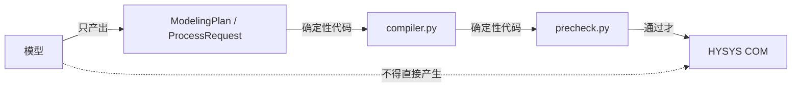

# 技术栈决策说明

本文说明**用什么、为什么用它、以及否掉了什么**。每条决策都给出被否决的备选方案
和实际代价——因为"选了 X"本身不是理由，"为什么不是 Y"才是。

对应的评分维度：**探索与系统设计（25%）**。

---

## 总览

| 层 | 选择 | 一句话理由 |
|---|---|---|
| 语言 | **Python 3.12** | HYSYS 自动化事实上只有 COM + pywin32 一条路，而 pywin32 是 Python 生态 |
| HYSYS 接口 | **COM（`win32com.client`）** | 官方唯一完整暴露建模能力的接口；没有 REST/CLI 可用 |
| 数据契约 | **pydantic 2** | 能把 `model_json_schema()` 直接交给模型做强制约束，堵住最常见的失败 |
| 流程编排 | **LangGraph** | 需要"追问后从中断处继续"，这要求可持久化的显式中断点 |
| 模型客户端 | **标准库 `urllib`**（不装 openai SDK） | 只用一个端点，自己控制超时/重试/错误分类，避免 SDK 版本漂移 |
| 模型 | **qwen3.7-flash**（基元律动） | 关掉推理后实测 **87% / 3.6 s**；见 4.3–4.4 |
| 工具层依赖 | **零第三方**（纯标准库） | 离线 144 项测试必须在没有 HYSYS、没有 pywin32 的机器上也能跑 |
| CLI | **argparse** | 标准库，工具层已在用 |
| 测试 | **unittest** | 标准库；与工具层保持一致，CI 不需要额外安装 |
| 凭据 | **环境变量，运行时读取** | 用户要求；且 AI 对话记录要交付，写进文件必然泄露 |
| 界面 | **待定**（倾向标准库 HTTP server） | 见第 4 节 |

---

## 1. 语言与 HYSYS 接口

**选择**：Python 3.12 + `pywin32` 的 COM 自动化。

**为什么**：

1. HYSYS 提供的是 **Windows COM 接口**。这是官方唯一能完整创建案例、配置反应器、
   读回结果并保存 `.hsc` 的自动化途径——没有 REST API，没有官方 CLI。
2. COM 在 Windows 上的主流绑定就是 `pywin32`，而它是 Python 包。用 C#/.NET 也能做
   （COM 互操作），但远程工作站上已验证的环境是 **Python 3.12.4 + pywin32**，换成
   .NET 等于把已经通过真机验收的东西全部重做，还失去与工具层的复用。
3. 工程计算生态（单位换算、物性、报告生成）在 Python 上最省事。

**否决的备选**：

| 备选 | 否决原因 |
|---|---|
| C# / .NET COM 互操作 | 远程已验证环境是 Python；重写工具层并重新真机验收，代价远大于收益 |
| HYSYS 的 Excel 插件 / VBA | 表达能力和可控性差，无法做子进程隔离与超时控制 |
| GUI 自动化（模拟点击） | 脆弱、不可测、无法无人值守；且题目要求"正确创建和配置"而非"看起来点过" |
| Aspen Plus 的 Python 接口 | 题目指定 HYSYS V15 |

**代价（必须承认的约束）**：

- **COM 对象不能跨进程**。这直接决定了架构：**一次命令行调用 = 一个完整自包含案例**，
  没有"打开案例稍后继续"的模式。
- **单线程公寓（STA）模型**，同一 HYSYS 实例必须**串行**调用。
- 进程内的错误会是裸 `E_FAIL`，没有有用的错误文本——这是本项目踩坑最多的来源，
  因此需要 `precheck.py` 在**进入 COM 之前**就把能查的都查掉。

---

## 2. 数据契约：pydantic

**选择**：pydantic 2（`pydantic==2.13.5`）。

**为什么**：

1. **本项目最常见的失败就是字段类型错**。`"temperature": "hot"`、`feeds` 写成对象、
   反应系数是字符串——这些在 17 份故意写错的 spec 测试里全都出现过。pydantic 在
   边界上直接拒绝，错误不会流进 spec。
2. **`model_json_schema()` 可以直接当模型的输出约束**。已实测基元律动端点接受
   `response_format: {"type": "json_schema", ...}`，所以：

   ```python
   from reactor_agent.schemas import ProcessRequest
   schema = ProcessRequest.model_json_schema()      # 直接交给服务端
   ```

   这样"契约"和"提示词"不会各说各话——**同一份 schema 既校验模型输出，又是给模型的指令**。
3. `extra='forbid'` 能挡住模型自创字段（否则会被静默忽略）。

**否决的备选**：

| 备选 | 否决原因 |
|---|---|
| `dataclasses` | 无类型校验、无 JSON Schema；要手写校验（正是我们要避免的重复劳动） |
| `attrs` | 校验能力弱于 pydantic，且不直接产出 JSON Schema |
| 手写 dict 校验 | 就是 `precheck.py` 已经在做的事，但它服务于**工具层**（要零依赖）；契约层用成熟库更可靠 |

**代价**：

- Agent 层多一个依赖。**但工具层仍然零第三方**——这个分界是有意的：工具层的 144 项
  离线测试必须在没有 HYSYS、没有 pywin32、甚至没装任何第三方包的机器上能跑。

---

## 3. 流程编排：LangGraph

**选择**：LangGraph（`langgraph==1.2.12`）+ `langchain-core`。

**为什么**：

1. **核心需求是"追问后继续"**。场景 3 的气化就是活例子：缺流量基准时不能执行，
   要问用户，然后**从暂停处继续**。这要求：
   - 可持久化的中断点（`interrupt()` + checkpoint）
   - 同一 `thread_id` 恢复
   - **恢复时不能重复已完成的 HYSYS 调用**（外部副作用无法回滚）
2. 需要**显式状态 + 有限重试预算**，而不是让模型自由决定下一步。
3. 主流程是可检查的：每一步的输入输出都能落盘、能测试。

**否决的备选**：

| 备选 | 否决原因 |
|---|---|
| 手写状态机 | 持久化、中断、恢复都要自己写；这正是 LangGraph 已有的部分 |
| 纯函数链（无状态） | 无法中断；"问完再继续"需要把整个上下文手工序列化 |
| 自由 Agent 工具循环 | **最需要避免的**。流程里最关键的判断（反应器选型）必须是确定性的规则，不能交给模型的自由发挥；而且自由循环容易绕过 `precheck`，难测试、难复现 |
| LangChain 的 AgentExecutor | 同上，且抽象更重 |

**关键设计**：即便用 LangGraph，**模型的职责边界仍是硬的**——



模型**永远不产生** COM 调用、文件路径或子进程参数。选型也不是模型"决定"的：
`selection.py` 按题目第 8 节的规则从**事实**推导，模型只负责把自然语言变成事实。

**代价**：`langgraph` + `langchain-core` 依赖较重（连同 `langsmith` 等约十来个包）。
可接受，因为它们在**同一个 conda 环境**里，且不影响工具层的零依赖。

---

## 4. 模型客户端与模型

### 4.1 客户端选择与端点

**选择**：**标准库 `urllib`** 直接调 `POST /chat/completions`，不引入 openai SDK。

**为什么**：

1. 只用到一个端点。SDK 的流式、函数调用、批处理等能力我们用不上。
2. **避免 SDK 版本漂移**。本项目已经被依赖问题坑过（远程 3.12.4 与本地 3.11 的差异、
   `pywin32` 缺失时的结构化报错），少一个会自带升级压力的依赖更好。
3. 需要**完全掌控**超时、重试上限和错误分类——这些正是计划里"错误处理与预算"那张表
   要精确控制的东西，套在 SDK 的异常体系里反而绕。
4. 实现量很小（约 80 行），而且 `scripts/probe_llm.py` 已经验证过这条路可行。

**端点与模型（已实测）**：

```
Base URL   https://tokenrhythm.studio/v1
端点       POST /chat/completions
模型       qwen3.7-flash   （EXTRA: enable_thinking=false）
凭据       TR_BASE / TR_KEY 环境变量
```

历史实测结果（`verification/legacy-model-evaluation/llm-probe.json`；新探测仍输出到已忽略的 `_demo/`）：

| 能力 | 结果 |
|---|---|
| `GET /models` | 200，23 个模型 |
| 普通对话 | 200 |
| `response_format: json_object` | 200，可解析 |
| **`response_format: json_schema`** | **200，服务端接受 pydantic 生成的 schema**——但模型**填不对**复杂 schema，见 4.2 |

**关于模型名的说明**：需求方先指定"deepseek 4.1"，该端点返回 `MODEL_NOT_AVAILABLE`
（`deepseek-4.1`、`deepseek-v4.1`、`deepseek-v4-1` 均不存在）；随后指定 `deepseek-flash`，
实测它是**推理模型**，需要 4000–8000 token 才吐出 42–47 字，耗时 27–47 秒。
最终由需求方确定使用 **`qwen3.7-flash`**（准确率优先），依据是 4.4 的串行基准。
模型名走配置，一个环境变量即可切换：

```bash
TR_MODEL=qwen3.7-flash              # 默认
```

**代价**：要自己写 HTTP 与重试。若将来需要流式输出或工具调用，再评估换 SDK。

### 4.2 LLM 边界契约的设计原则（实测得出，代价不小）

**给模型的 schema 不等于内部契约。** 这一条是踩了坑才明白的：

最初把 `ProcessRequest` 的完整 schema 交给模型，结果它输出**键名乱码**：

```json
"stoichiometry": { ": ": -2 },
"flows": { ": {": 10000, "": 380, ":-2.5MPa,65900-6700": -1 }
```

原因是 `dict[str, float]` 在 JSON Schema 里变成 **`additionalProperties`**——一个开放
字典。在 `strict` 模式下，模型必须**自己发明键名**，于是产生了上面这种东西。叠加三层
嵌套和 `extra='forbid'`，模型直接崩溃。而用简单 schema 时输出完全正常。

**四条规则**：

| 规则 | 做法 | 实测依据 |
|---|---|---|
| **1. 重复结构用数组，不用开放字典** | `stoichiometry: dict[str,float]` → `species: [{name, coefficient}]`；`fractions` 同理 | 开放字典导致键名乱码；改成数组后结构完全正确 |
| **2. 字段名必须覆盖原文的语义** | 原文"压力 13.5 bar"是**工况**压力而非进料压力 → schema 里既要有 `feed_pressure`，也要有 `case_pressures` | 只有 `feed_pressure` 时模型**无处安放**这个值，直接丢成 null |
| **3. 要求模型"照抄"，不要归一化** | 提示词明确"copy numbers and units EXACTLY as written"；再加一句"题目给出的数值留空是错误" | 一个候选把 `50%` 读成 `0.5`；另一个把 `62wt%` 当成转化率。加那句后 78%→89% |
| **4. 给它一个 `missing_information` 数组** | 让"不编造"成为它可以**主动做**的事，而不是必须记住**不要做**的事 | 模型会自己列出"Nm3/h 的标准状态需要确认" |

**归一化属于确定性代码，不属于提示词**：`"℃"` / `"度"` / `"摄氏度"` → `C`；
`100` → `1.0`；组分名 → HYSYS 库名；**`case_pressures` → `feed_pressure`（当两者
语义相同时）**。这些都在 `compiler.py` 和 `precheck.py` 里做。

**边界保持不变**：模型只负责把自然语言变成**事实**，选型仍由 `selection.py` 的规则
从事实推导。模型**不决定反应器类型**，也不产生任何 COM 调用或文件路径。

### 4.3 服务端行为（实测，影响客户端设计）

| 现象 | 实测 | 应对 |
|---|---|---|
| **限流** | 并发 10–18 个请求触发 `429 RATE_LIMITED`；**连续 24 个请求全部失败而单次调用正常** | 串行调用 + 请求间隔（实测 2.5 s 足够） |
| **偶发 503** | 串行 5 次里出现 1 次 `503 LITELLM_UNAVAILABLE` | 指数退避重试（3 次、5 秒起） |
| **偶发 401** | 高频请求后出现 `UNAUTHORIZED`，**等待十几秒后自愈** | 不要误判为凭据失效；退避后重试 |
| **推理模型** | 先把 token 用在 `reasoning_content`，预算不足时 **`content` 为空或被截断，但 HTTP 200、`finish_reason='length'`** | **直接关掉推理**，不要靠加大预算硬撑 |

**最后一条最阴险**，而且**关掉推理不只是省钱——它让结果更准**：

| `qwen3.7-flash` 配置 | 重整场景得分 | 耗时 | reasoning tokens |
|---|---|---|---|
| 默认（推理开启） | **60%** | 28.4 s | 2646 |
| **`enable_thinking: false`** | **80%** | **3.6 s** | **0** |
| `reasoning_effort: low` | 80% | 40.2 s | 3307 |
| `reasoning_effort: none` | 40% | 49.0 s | 3493 |

原因：推理把预算吃光后**输出被截断**（实测报过 `Unterminated string`），
所以"想得多"反而"答得少"。

**最终配置**：

```python
MODEL = 'qwen3.7-flash'
EXTRA = {'enable_thinking': False}    # 关键：3.6 s 且更准
MAX_TOKENS = 4000
```

### 4.4 模型与调用配置：qwen3.7-flash + enable_thinking: false

**决策由需求方确定（以准确率优先）**，随后实测发现**关掉推理让同一模型又快又准**，
所以最终配置是：

`python
MODEL = 'qwen3.7-flash'
EXTRA = {'enable_thinking': False}
MAX_TOKENS = 4000
`

#### 最终配置的实测结果（3 轮 × 2 场景）

| 场景 | 三轮得分 | 平均耗时 |
|---|---|---|
| 甲苯歧化 | **100% / 100% / 100%** | 3.2 s |
| 甲烷蒸汽重整 | 100% / 20% / 100% | 4.0 s |
| **合计** | **平均 87%** | **平均 3.6 s** |

对照同模型**默认配置**（推理开启）：**0.80 / 24.5 秒**。也就是说，关掉推理
**快了约 7 倍，准确率还更高**——原因见 4.3 节（推理吃光预算导致输出截断）。

#### 候选对比（串行 + 重试，排除信息不足的气化场景）

| 模型 | 甲苯+重整 | 平均耗时 | 备注 |
|---|---|---|---|
| **qwen3.7-flash（关推理）** | **0.87** | **3.6s** | 甲苯三轮全对 |
| qwen3.7-flash（默认） | 0.80 | 24.5s | 重整受推理截断拖累 |
| mimo-v2.6-flash | 0.75 | 27.6s | 不稳定（一轮 504 超时） |
| deepseek-v4-flash-0731 | 0.73 | 2.2s | 偶发漏字段（由预检转成追问） |

#### 与模型无关、必须保留的三项机制

**① 强化提示词**（实测 +11 个百分点）：

| 提示词 | 准确率 | 稳定性（3 次） |
|---|---|---|
| 原始 | 78% | 100% / **33%** / 100%（会崩盘） |
| **强化** | **89%** | 83% / 100% / 83% |

**加的那句话**：*题目里给出的每个数值都必须出现在对应字段；把它留空是错误。*

**② 字段名覆盖原文语义**：case_pressures 就是这么加上的。加之前模型把
13.5 bar 直接丢成 null（**无处安放**），加之后三次全部提取到。归一化时再由确定性
代码决定工况压力与进料压力在本场景是否等价。

**③ 必填字段校验 + 重试**（**必填项按场景配置，不能一刀切**）：

`python
REQUIRED = {
    'conversion': ('feed_total', 'feed_temperature', 'feed_pressure',
                   'conversion_percent'),
    'gibbs':      ('feed_temperature', 'feed_pressure', 'outlet_temperatures'),
}
`

> **踩过的坑**：一开始对所有场景用同一组必填字段，结果重整场景被判「全字段缺失」——
> 因为 Gibbs 反应器**本来就不需要 conversion_percent**，而题目说进料流量可以自定，
> 所以 eed_total 为空**也是对的**。**校验规则必须反映场景语义，否则会把正确行为
> 判成失败。**

#### 气化场景不计入模型评分

该题本身信息不足（未给 Nm3/h 的基准与所指流股、未给煤的组成），模型填不全是
**正确行为**。系统对该场景的判据只有一条：**是否原样保留 Nm3/h 而不擅自换算**。

#### 切换成本与降级

`ash
TR_MODEL=qwen3.7-flash              # 默认
TR_MODEL=deepseek-v4-flash-0731     # 备用：更快，准确率略低
`

模型名走环境变量，改一个变量即可切换；这也支撑 4.3 节降级链的最后一环：
**模型不可用时明确报智能体暂不可用，绝不伪造结果**。

**评测脚本**：scripts/bench_llm.py（准确率 + 速度）、scripts/pick_model.py
（批量选型，TR_MODELS=a,b,c 指定候选）。结果落在 _demo/，不写任何凭据。

## 5. 凭据管理

**选择**：**只在运行时从环境变量读取**，不写入任何文件。

```python
BASE = os.environ.get('TR_BASE', '')
KEY = os.environ.get('TR_KEY', '')
MODEL = os.environ.get('TR_MODEL', 'qwen3.7-flash')
```

**为什么**：

1. 用户明确要求"凭据在界面运行时填，代码不存密钥"。
2. **存在真实的泄露路径**：题目要求交付「AI 开发记录（对话 session）」。凭据一旦
   出现在对话或代码里，就会随交付材料一起交出去。
3. 违反这条的后果不是"不方便"，而是密钥泄露。

**落地要求**：

- `probe_llm.py` 只记录 `key_present: true` 和 base URL，**不记录 key 本身**
  （已全项目扫描确认无残留）
- LangGraph 的 **checkpoint 里不得出现凭据**（state 只放可序列化业务数据）
- 日志、`result.json`、`REPORT` 都不写凭据
- 演示结束后**轮换该 key**

---

## 6. 测试

**选择**：**`unittest`**（标准库），不引入 pytest。

**为什么**：

- 工具层已经在用 `unittest`（`selfcheck.py` 的手写断言器 + `test_reliability.py`），
  保持一致就不必维护两套运行方式。
- 标准库，`python -m unittest` 在任何 Python 上都能跑，交付方不需要额外安装。
- 参数化用 `subTest` 足够（已在能力表测试里用了）。

**当前规模：185 项，全部通过**

```
hysys_tools.selfcheck          110
hysys_tools.test_reliability    34
reactor_agent.test_selection    18
reactor_agent.test_compiler     23
```

一键入口：`scripts/run-all-tests.cmd`

**测试策略（比工具选择更重要）**：

| 层次 | 做法 |
|---|---|
| 纯逻辑 | 选型规则、单位换算、元素守恒——**不碰网络也不碰 HYSYS** |
| 接口层 | 假 COM 对象复现真机故障（哨兵值、E_FAIL、非空白案例） |
| 模型层 | **固定模型响应**回放，断言抽取与编译结果；不在测试里调真实 API |
| 端到端 | 远程真机 + 基线容差比对（`baseline_expected.json`，rel=1e-6） |

**经验**：本项目抓到的设计错误里，**测试和探测当场发现的那几个比真机上发现的便宜得多**
（Gibbs 判据把重整判错、`OperatingCase` 温度同步漏掉、探测脚本把 POST 发成 GET）。
所以每个新模块都先配离线测试。

---

## 7. 明确不用的技术，及原因

| 技术 | 为什么不用 |
|---|---|
| **FastAPI / Flask** | MVP 里 Agent、界面、HYSYS 在**同一个远程 Windows 会话**内，不需要 HTTP 服务层。加一层只增加部署与调试成本 |
| **Docker** | HYSYS 是 Windows 桌面 COM 应用，装不进容器；容器化对本题无收益 |
| **Redis / PostgreSQL** | 单机、单用户、串行执行。状态用 LangGraph 的 SQLite checkpoint 足够 |
| **向量库 / RAG** | 三个场景的知识量小且结构化（题目原文 + 规则），不需要检索。加了反而引入不可控的召回错误 |
| **自由多 Agent 协作** | 流程是确定的，选型是规则。多 Agent 只会让"谁改了什么"难以追溯，且难以测试 |
| **`ActiveDocument`** | **明令禁止**：不能碰用户正在看的案例。只用 `SimulationCases.Add` 返回的对象 |
| **按名字关闭案例** | 真机上 `case.Name` 恒为 `"Case"`，按名字匹配一个都关不掉，还可能关错别人的案例 |
| **GUI 录制/回放自动化** | 脆弱、不可测；且无法证明"配置正确"，只能证明"点过了" |

---

## 8. 依赖清单

`requirements.txt`（Agent 层）：

```
pydantic==2.13.5            # 数据契约 + JSON Schema 生成
langgraph==1.2.12           # 主流程 StateGraph、interrupt、checkpoint
langchain-core==1.6.6       # langgraph 底层，显式锁定防漂移
# pywin32 仅在工作站需要，本地装了也无法验证，故在文件中注释说明
```

**工具层零第三方依赖**。这是刻意的：离线 144 项测试要能在任何 Python 上跑。

环境：

```
conda create -n hysys-agent python=3.12 -y
conda activate hysys-agent
python -m pip install -r requirements.txt
```

**Python 版本与远程一致（3.12）**，避免"本地能跑、远程不能"。

---

## 9. 一句话总结

```
Python + pywin32/COM    —— 因为 HYSYS 只有 COM 这一条自动化路径
pydantic + JSON Schema  —— 因为它能同时校验模型输出并约束模型
LangGraph               —— 因为需要"追问后从断点继续"且不能重复副作用
标准库 urllib           —— 因为只用一个端点，自己控制错误分类更可靠
标准库 unittest         —— 因为工具层已经在用，且交付方零安装
环境变量读凭据           —— 因为对话记录会被交付，写进文件必然泄露
```

**最重要的不是选了这些，而是边界**：模型只产出结构化意图；选型由规则从事实推导；
编译与预检是确定性代码；**模型永远不碰 COM**。