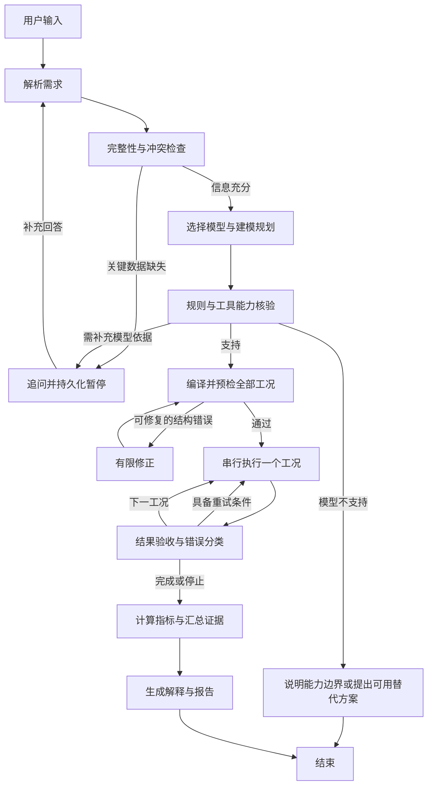

# HYSYS Agent 搭建规划与考核差距检查

日期：2026-10-02（Asia/Shanghai）  
目标：基于现有 Python 工具层，用 LangGraph 完成“自然语言 → 建模判断 → HYSYS 新建并求解 → 校验 → 中文结果”的闭环。本文是后续实施清单，本轮未实现 Agent 或修改工具层业务代码。

> 后续进展：工具层已发布本地可靠性修复版 `2026-10-02-reliability-1`，修复内容及远程验收流程见 [REMOTE_VALIDATION.md](REMOTE_VALIDATION.md)。下文检查结果保留为规划时的基线；其中稳定性、文件名、能力表和部分文档问题已经处理，远程验证仍待回传。Agent 尚未实现。

## 1. 结论与实施优先级

建议采用 **Python + LangGraph StateGraph + 结构化数据模型 + 串行 HYSYS 工作进程**。先完成一条端到端主流程，再将适合独立推理的部分组织为多个角色。

现有工具层值得保留：已经有 JSON 输入输出、离线预检、COM 建模、结果守恒检查、案例保存及所有权保护。Agent 的主要工作是理解需求、区分缺项与假设、正确选型、生成可执行规格、组织多工况和解释真实结果。

最优先的四件事：

1. 固化现有成功基线，同时补齐执行结果可靠性的关键检查。
2. 做通甲苯的自然语言闭环，再接入重整两工况。
3. 尽早解决气化的流量和煤定义，并完成当前工具层的真机验证；这项不能排到录屏之后。
4. 全程积累代码提交、日志和探索证据，最后完成 README、1–2 页报告和录屏。

**当前应描述为：两个考核场景已有工具层成功记录，共三个成功工况；第三个考核场景尚未完成。** 不宜表述为“三个考核场景全部通过”。

## 2. 本次检查范围和证据

已检查：

- 根目录《AI化工反应器建模实战考核(1).md》全文，特别是测试场景、第 8 节选型逻辑和第 9 节补充说明。
- `hysys_tools/core.py` 的相关接口，以及 `main.py`、`reactor.py`、`precheck.py`、`validate.py`、`examples.py`、`selfcheck.py` 的相关实现。
- `TOOL_REFERENCE.md`、根目录《项目记忆与续接.md》和早期《实施计划.md》。这些文档存在版本差异，本规划以现有代码及实际 JSON 记录为准。
- `tool-layer-runs/20261002-103928` 和 `tool-layer-runs/20261002-111439` 的结果。
- `../hysys-ai/phi_select.py`、`phi_llm.py`：可参考旧设计，但需要适配，不能直接认定为可用 Agent。
- 本机执行 `python -m hysys_tools.selfcheck`：**110 passed, 0 failed**。这是模拟 COM 的离线验证，不等于本轮重新运行 HYSYS。

本轮没有连接远程 HYSYS，也没有重新验证热力学数据库、固体相态或历史案例内的配置。下文的真机数值来自已有结果文件。

### 2.1 考核要求与当前覆盖

| 考核要求 | 当前证据 | 后续缺口 | 优先级 |
|---|---|---|---|
| 自然语言输入 | 当前主入口是 spec JSON | 需求抽取、追问、输入变更、多轮恢复 | P0 |
| 自主选型并解释 | 旧目录有规则模块；现工具由 spec 指定类型 | 选型结果、证据、可执行能力三者一致 | P0 |
| 甲苯歧化 | Conversion 真机记录 PASS，转化率约 50% | 自然语言闭环，明确异构体假设和绝热边界 | P0 |
| 重整两个温度 | 两份 Gibbs 真机记录 PASS | 多工况组织、比较、替代模型说明和适用性核实 | P0 |
| 气化及 CO 收率 | 最新工具运行在预检时拒绝 Nm³/h | 基准澄清、固体支持证据、实际建模和收率验收 | P0 |
| Equilibrium | 代码在预检中明确禁用 | 考核类型覆盖风险；有限时间的替代实现研究 | P1，风险较高 |
| 额外场景 | 支持组分与模型组合有限 | 参数变化、模糊表达、缺项、不支持模型的正确处理 | P1 |
| CSTR/PFR | 当前工具不能创建 | 正确识别并明确能力边界，完整执行放后续 | P2 |
| GitHub/README/报告/录屏/AI 记录 | 交付目录未见完整套件；未见本目录 Git 元数据 | 从第一阶段开始积累，到最后整体验收 | P0 |

### 2.2 历史结果基线

来源：`tool-layer-runs/20261002-111439/*/result.json`。

| 工况 | 执行模型 | 工具状态 | 关键读数 |
|---|---|---|---|
| 甲苯 10000 kg/h、380°C、2.5 MPa | Conversion，绝热 | PASS | 甲苯转化率 49.99999999999999%，热负荷 0 kW |
| 重整出口 710°C | Gibbs，固定出口温度 | PASS | CH₄ 转化率 54.035809%，热负荷 39988.614757 kW |
| 重整出口 600°C | Gibbs，固定出口温度 | PASS | CH₄ 转化率 30.352385%，热负荷 20159.497952 kW |
| 水煤浆气化原题输入 | Gibbs，计划固定出口温度 | FAILED | Nm³/h 的流股和标况未定义，未创建案例 |

这些数值用于同配置回归。不能用它们覆盖不同工况的实际结果，也不能把历史结果展示成新输入的计算结果。

## 3. 工具层接入前需要处理的问题

### 3.1 已有设计可以直接沿用

- 一次调用创建一个新案例，接收 spec，返回 result。
- `--validate-only` 在连接 HYSYS 前检测输入错误。
- 组分别名、单位、元素配平和转化率检查由代码处理。
- 使用本次创建的案例对象，不通过 `ActiveDocument` 修改用户正在看的案例。
- 保存成功案例和可保存的失败案例；仅关闭本次拥有的案例。
- 同一 HYSYS 实例串行运行；每次尝试使用全新的输出目录。
- 工具控制台保持 ASCII；中文由 UTF-8 文件及界面展示。

### 3.2 接入前必须修正或加守卫

| 问题与位置 | 对 Agent 的影响 | 建议处理 |
|---|---|---|
| `reactor.py::solve_and_read`：超时前得到过有效读数、但未满足 3 次稳定读数时，只追加 warning，仍返回 best | 守恒通过也可能返回 PASS，不能据此宣称可靠收敛 | 将未稳定、最终仍求解中等情况返回明确失败；补测热负荷有限且不是未知值；有可用原生求解状态时一并读回 |
| `precheck.py`：`open_questions` 只产生 warning | 补了数字就可能绕过尚未回答的关键建模问题 | Agent 中独立维护 `blocking_questions`；阻塞问题未解决不能执行。文献温区等非阻塞风险单独记录 |
| `list_capabilities()` 以描述字符串表达能力 | “Gibbs 已验证”容易被理解成所有固体、热边界和组合都已验证 | 增加机器可读组合表，标识 verified/experimental/unsupported 及证据文件 |
| `main.py` 用 `case_name` 拼接保存路径 | 模型生成的名称可能含目录分隔符或 Windows 保留名 | 由适配器生成 case ID 和文件名，限制输出到本次 run 目录；路径和命令不由 LLM 决定 |
| 多反应 Conversion 的校验逐反应比较同一个基准组分的总消耗 | 共用基准组分的多个反应，单反应转化率与总转化率可能混淆 | MVP 限制到已验证的单个合并反应；后续显式定义并行/顺序反应与转化率基准 |
| 输出 T 不匹配时抛出 `SpecError` | 可能被 Agent 当成应修改输入的错误 | 将已执行但读回不满足条件归入结果问题；Agent 根据执行阶段和错误码判断，不只看字符串 |

补充：当前检验以守恒、转化率、稳定读数为主。守恒通过不证明 Gibbs 最小化结果的热力学有效性。对重整保留温度对比，对气化增加相态与残余碳核验。

### 3.3 需要更新的文档

`TOOL_REFERENCE.md` 与现代码存在差异，接入时一起修订：

- 文档一处说只用 `feeds[0]`；现预检会拒绝多进料。
- 文档后段仍说 `SPEC_ERROR` 不写 result；现 CLI 会尝试写出。
- 文档称 `co_mole_fraction_dry` 尚未实现；现 `validate.py` 已实现。
- 文档称缺 `base_component` 到运行后才失败；现预检已拦截。
- 组分别名说明前后不一致；现预检和执行已有统一映射。
- 不能承诺任何失败都有 `steps.json`：当前预检/连接失败等分支未经过 `build_case.finish()`。
- 《项目记忆与续接.md》顶部“三场景全部通过”与该文自身列出的气化拒绝结果不一致，应改为两个场景、三个成功工况。
- 记忆文档声称旧固体碳探针通过，工具参考称未验证。应找到相应 spec、result、steps、HSC，并确认是否走当前工具层；找到前标注“历史记载，当前工具路径待核验”。

### 3.4 旧选型代码的复用边界

`../hysys-ai/phi_select.py` 可作为规则草稿，不能原样接入：

1. 动力学分支解释为 CSTR/PFR，却返回 `spec.reactor.type`，可能输出另一种类型。
2. 相态不是纯 liquid 时默认 vapour，混相、未知相态与聚合反应没有充分分流。
3. `spec.reactor.type == 'conversion'` 被当成已知转化率证据，会让模型先猜的类型影响规则判断。
4. 解释文本写死“50% 转化率”，额外输入改为 30% 时会出现错误解释。
5. “没有反应列表”就容易进入 Gibbs 分支，缺资料不能自动等同于适合自由能最小化。
6. 收率和选择性不能普遍直接当成转化率；需要反应式、基准和独立约束足以确定反应进度。

新规则应读取用户事实和已接受假设，再产生模型选择；反应器类型不能成为自身的选型证据。

## 4. 三个场景的建模方案

### 4.1 甲烷蒸汽重整

**建模判断**：题目给出了两条可逆反应和固定出口温度，Equilibrium 是自然的候选模型；当前可执行路径为 Gibbs。题目第 8 节允许按适用性选择，但第 3 节又提示三个场景对应不同类型，因此仅演示 Conversion + Gibbs 存在类型覆盖评分风险，不能承诺替代必然被认可。

建议决策记录同时保存：

```text
preferred_reactor: equilibrium
execution_reactor: gibbs
fallback_reason: 当前工具无法设置已尝试的 Equilibrium Ln(K) 来源
model_scope: CH4/H2O/CO/H2/CO2 候选组分的平衡模型
limitations: 未考虑积碳、动力学与传热速率限制；热力学数据适用性待核实
```

实施要点：

- 生成 710°C 和 600°C 两个工况，进料均为 520°C、13.5 bar，CH₄:H₂O = 1:2.7。
- 沿用示例 1000/2700 kmol/h 作为自选规模，并显示按 8000 h/y 计算的甲烷约 12.8 万吨/年；这是设计基准。
- 展示采用绝压、零压降的假设。两个工况除出口温度和标识外保持一致。
- 固定出口温度需要外部供热；不把热负荷写成纯反应热，也不称绝热。
- Gibbs 的物种集合决定可出现的产物；给定五组分的结果不代表包含固碳或其他烃类的完整体系。
- 求解后给出湿基/干基气体组成、CH₄ 转化率、H₂ 产量、热负荷与变化量。
- 历史记录提到 Gibbs 数据温区读回异常；需核实属性含义、单位、来源和实际使用方式。未核实前作为待查风险，不直接把该读回值当成数据必然失效的证明。

Equilibrium 补齐设置一个约 2–3 小时的研究上限：先整理已有失败证据，查工作站官方帮助，研究可追溯 K(T) 输入或可复用且经验证的配置路径。不要重复已经失败的属性赋值探针，不填无来源固定 K。若采用模板，应验证新案例创建、配置读回及模板来源，明确自动化范围。未完成时保留真实能力缺口与 Gibbs 适用性说明。

### 4.2 甲苯歧化

- 没有动力学参数，明确 50% 转化率，因此选 Conversion。
- 10000 kg/h、380°C、2.5 MPa；反应元素配平；甲苯为基准组分。
- 项目记忆记录邻/间/对二甲苯各 1/3 已获用户同意，后续沿用并注明来源，不重复询问，不称为工业分布或预测结果。
- 当前成功路径为绝热、零压降，出口温度由 HYSYS 计算；380°C 是入口温度。热边界是实现假设，应展示，并允许用户覆盖。
- 独立检查：甲苯转化率 50%（现容差 0.05 个百分点）、苯和总二甲苯等摩尔生成、剩余甲苯约 5000 kg/h、元素及质量守恒。
- 输出分开列汽相、液相和全出口汇总。全出口组成不能直接称为气相组成。

### 4.3 水煤浆气化

这是必须尽早关闭的考核缺口。Agent 应把缺项一次性说明清楚：

1. 80000 Nm³/h 指哪股流？其标准温度、压力及干/湿基定义是什么？
2. 煤可否简化为纯固体碳，还是有元素分析和煤表征数据？不计灰分不能自动推出纯碳。

处理分支：

| 用户补充的信息 | 处理方式 |
|---|---|
| 给出水煤浆质量流量 | 按 62 wt% 煤、38 wt% 水生成质量基准进料 |
| 80000 Nm³/h 实为产品气目标 | 这是带目标产量的反算任务；先确定产品气基准，再通过可验证的缩放或迭代求进料，最后重新在 HYSYS 验证目标 |
| 明确某股气体的标准体积流量 | 在指定标准状态及必要的压缩因子约定下转换，保留来源与单位；不能拿来直接定义液固浆料 |
| 只允许教学假设基准 | 使用明确接受的质量基准演示；输出注明假设，不能称原题 80000 Nm³/h 已满足 |
| 尚未澄清 | 返回待补充，不创建正式案例，不给出伪精确产量 |

执行模型选 Gibbs，出口固定 1400°C、40 bar。题目未提供氧气，不能自动加氧来声称自热气化；采用外供热边界时明确展示所需热负荷。

若纯碳假设成立，候选组分至少包含 Carbon、H₂O、CO、H₂、CO₂、CH₄。必须核实 Carbon 被如何表示、能否正确参与固体平衡、未反应碳从哪个出口读出。当前工具仅汇总 VAPOUR/LIQUID 两个命名出口；若 HYSYS 的固相需要额外接口，必须补齐，不能漏读后宣称零残碳。

验收指标：

```text
CO 收率 = (出口 CO 摩尔流量 - 入口 CO 摩尔流量)
          / 进煤中碳原子摩尔流量 × 100%

固体碳转化率 = (入口固体碳 - 出口残余固体碳) / 入口固体碳 × 100%

干基气体 CO 摩尔分数 = 干气 CO 摩尔流量 / 总干气摩尔流量
```

纯碳+水且无其他含碳进料时，当前工具的总进料碳分母与煤碳分母一致。扩展到多种含碳进料时必须分别核算来源，不能沿用“全部进料碳”等同“煤碳”。干气应按相态汇总后扣水；当前扣水和 Carbon 的算法仅在相应物种/相态假设成立时使用。

## 5. 推荐架构：LangGraph 主流程 + 三个推理角色

### 5.1 分工

| 模块/角色 | 实现形式 | 输入 → 输出 | 允许的职责 |
|---|---|---|---|
| 需求解析角色 | LLM + Pydantic | 用户文字、补充回答 → 结构化需求、来源、缺项 | 理解自然语言、拆工况、识别冲突 |
| 建模规划角色 | LLM + 规则校验 | 需求、能力表 → 建模方案、理由、候选物种与假设 | 工程判断，提出替代方案 |
| 结果解释角色 | LLM + 模板 | 已验证结果、选择理由 → 中文解释 | 解释温度影响、限制与假设 |
| 主流程编排 | LangGraph | state → 下一节点 | 顺序、追问、恢复、重试和终止 |
| 规格编译 | Python | 方案 → 当前工具 spec/1 | 单位映射、字段构造、名称规范化 |
| HYSYS 执行 | Python 子进程 | spec → result/steps/HSC | 独占调用现有工具层 |
| 数值校验/指标计算 | Python | 真实读回 → 质量状态、表格 | 守恒、转化率、CO 收率、干湿基 |

初版可以是三个独立提示词节点共用一个模型客户端，不必先做每个角色的自主工具循环。后续若有实际收益，再将建模规划与审查拆为可独立迭代的子图。

“多个角色”不意味着并发操作 HYSYS。所有模拟任务通过同一工作队列和跨进程锁，逐个执行。重整两个工况也串行执行。

LangGraph 官方文档区分预定路径的工作流与动态 Agent；本项目以可检查的主流程组织工程判断节点。参考：[Workflows and agents](https://docs.langchain.com/oss/python/langgraph/workflows-agents)。

### 5.2 主图



补充路由规则：重试预算耗尽、预检不可修复时结束为失败或待澄清；某个工况失败时保留其他已成功结果，整体返回 PARTIAL，不把缺失工况补成预测值。

### 5.3 状态与数据契约

建议区分三层数据，避免 LLM 直接生成完整 COM 配置：

1. `ProcessRequest`：用户到底要求什么，允许字段缺失，保留原文来源。
2. `ModelingPlan`：模型、物种、物性方法、热边界、假设、工况与执行能力。
3. `ToolSpec`：编译后的严格 `hysys-agent/spec/1`；再经现有预检。

建议字段：

| 对象 | 必需字段 |
|---|---|
| `ProcessRequest` | `source_text`、组分、反应、进料与单位、工况、动力学/平衡/转化率约束、目标指标、字段来源 |
| `Question` | `id`、`field`、`question`、`blocking`、`reason`、`answer` |
| `Assumption` | `id`、`field`、`value`、`source`、`accepted`、`scope`；区分历史确认、题目允许自定和新提出 |
| `SelectionDecision` | `preferred_reactor`、`execution_reactor`、`rule_id`、`evidence`、`alternatives`、`capability_status`、`fallback_reason` |
| `OperatingCase` | `case_id`、温压/流量覆盖、spec、`spec_hash`、`attempts`、执行状态、结果路径 |
| `RunManifest` | `run_id`、`thread_id`、代码版本、工具能力版本、开始结束时间、工况清单、产物路径；不含连接凭据 |

LangGraph 的 state 建议只放可序列化对象：

```python
# 设计草图；不是已实现接口
class AgentState(TypedDict):
    thread_id: str
    run_id: str
    user_text: str
    request: dict
    questions: list[dict]
    assumptions: list[dict]
    decision: dict
    cases: list[dict]
    current_case_index: int
    results_by_case: dict
    retry_counters: dict
    status: str
    report_path: str | None
```

凭据、模型客户端、COM 对象和子进程句柄放运行时依赖容器，不放 state、checkpoint 或日志。修改用户输入后对受影响的 plan/spec/result 失效处理，不能继续显示旧结果为新工况结果。

### 5.4 选型规则的执行顺序

1. 先检查用户要求、数据冲突和相态是否足够明确。
2. 有完整速率规律及必要设备数据，并要求动力学预测：按题目约定全液相 CSTR、全气相 PFR；混相、未知相或聚合另行判断。只有“管式/釜式”不算完整动力学数据。
3. 无动力学且给出足够的转化率约束：Conversion。只给收率/选择性时，先验证能否推导独立反应进度。
4. 已知可逆反应且有可追溯的平衡数据：Equilibrium 候选，随后检查工具可执行能力。
5. 复杂高温、关注平衡产物分布，且候选物种和相态数据可用：Gibbs 候选。
6. 缺信息时追问，不能为了继续执行而默认 Gibbs。
7. 用户强制指定模型与数据/目标矛盾时解释冲突；不静默改模型。

选择与执行分离：理论上选 PFR，即使工具不支持，也应保留 PFR 的选择并返回 UNSUPPORTED；不能篡改选择成 Conversion。

### 5.5 追问、恢复和执行幂等

- 关键缺项一次打包询问；不对已确认的二甲苯比例重复提问。
- 固定的合理默认值可以展示后使用；改变问题含义的假设必须有明确来源或用户回答。
- 使用 `interrupt()` 暂停，使用同一个 `thread_id` 恢复；初版以本机 SQLite checkpoint 支持进程重启后的恢复。
- 中断节点和 COM 执行节点分开。恢复可能重新进入节点，不能在提问前先创建案例。
- 持久化保存“工况+spec_hash+attempt_id”的执行台账。已经完成且证据一致的工况恢复时不重复创建。
- 若崩溃发生在 COM 已产生副作用、结果尚未登记时，进入待核验状态。checkpoint 本身不能保证外部 HYSYS 操作只发生一次；不要自动重放未知状态的执行。
- 本机模型配置重启后重新输入，不能为了恢复会话把密钥或服务配置写进 checkpoint。

依据：[Persistence](https://docs.langchain.com/oss/python/langgraph/persistence)、[Interrupts](https://docs.langchain.com/oss/python/langgraph/interrupts)。具体导入路径和依赖版本在实施时锁定并做恢复测试。

## 6. HYSYS 适配器设计

MVP 让 Agent、UI 与 HYSYS 运行在同一远程 Windows 用户会话内。这样无需先开发远程 COM 或网络服务；本地用于代码与离线测试，打包后在工作站实测。

建议对外暴露四个窄接口：

```python
get_capabilities() -> CapabilityReport
validate_spec(spec: ToolSpec) -> ValidationReport
execute_case(spec: ToolSpec, run_context: RunContext) -> ExecutionResult
load_result(result_ref: ResultRef) -> ToolResult
```

实现要求：

1. `execute_case` 由程序构造参数列表，`shell=False`，显式设置工作目录和 Python 解释器。
2. 每次生成 `runs/<run_id>/<case_id>/attempt-<n>-<uuid>/`，禁止路径复用和覆盖旧证据。
3. 将 spec 写到 UTF-8 JSON，运行当前 `python -m hysys_tools --spec ... --folder ...`，同时保存退出码和 ASCII stdout/stderr。
4. 优先直接复用纯 Python 的预检函数；subprocess 边界保留在实际 COM 执行处。
5. 使用 HYSYS 实例级别的跨进程互斥锁；UI 双击、多个浏览器会话也必须串行。
6. 工具已有 60 秒求解等待；外层为完整建模过程设置更长总超时，初始可配 180 秒，经真机耗时调整。
7. 超时终止本次 Python 工作进程，不杀 HYSYS；确认实例可用及本次残留情况后才允许后续模拟。
8. 不假设 `result.json` 一定存在：导入失败、进程终止、写盘错误都可能无结果。适配器补写自己的失败记录，保留原错误，不伪造工具 PASS。
9. 执行器只返回数据和证据路径，不让 LLM 自行写 Shell、COM 属性或任意 Python 后执行。
10. 模型调用只发送该轮必要的需求、能力摘要和结果摘要；凭据从运行时注入。默认关闭可能记录连接配置的外部追踪；如需追踪先明确脱敏方案。

### 6.1 错误处理与预算

| 类型 | 行为 | 初始预算 |
|---|---|---|
| LLM 输出无法解析/结构错误 | 返回结构化错误给模型修正，保持原始工程约束 | 最多额外 2 次 |
| 缺必要工程数据 | interrupt 追问 | 不计为技术重试 |
| 单位别名、字段拼写、可确定的格式错误 | 程序修正或要求模型修正，重新预检 | 最多 2 次 |
| 更改流量含义、煤定义、温度、转化率等 | 不能作为自动修复 | 回到需求澄清 |
| 环境不可连接 | 提示启动 HYSYS/处理弹窗，等待环境恢复 | 不连续盲重试 |
| 已确认的目录冲突 | 使用新 attempt 目录，保留原 spec | 最多 1 次 |
| COM 超时/结果不稳定 | 记录失败并核验环境；有证据支持瞬态故障时再试 | 最多 1 次 |
| 守恒/指定转化率校验失败 | 保留现场，返回结果不可信 | 不自动改题目参数 |
| 未支持模型/组分/相态组合 | 明确能力边界或提出有依据替代 | 不自动降级为成功 |

最终任务状态建议：`WAITING_INPUT / READY / RUNNING / PASS / PARTIAL / FAILED / UNSUPPORTED`。工具状态原样保留；Agent 的 PASS 必须同时满足阻塞问题清空、工具成功、结果通过验收、证据文件可用。

## 7. 目录和依赖建议

```text
hysys-agent/
  hysys_tools/                 # 保留现有工具层，必要修复单独提交
  reactor_agent/
    __init__.py
    __main__.py                 # CLI 入口
    schemas.py                 # Request / Plan / Decision / Result
    state.py                   # 图状态
    graph.py                   # StateGraph 与路由
    config.py                  # 非敏感配置；敏感设置仅运行时存在
    llm.py                     # 模型客户端与结构化响应校验
    selection.py               # 选型约束
    capabilities.py            # 组合级能力与证据
    compiler.py                # ModelingPlan -> spec/1
    nodes/
      intake.py
      clarify.py
      plan.py
      execute.py
      verify.py
      explain.py
    adapters/
      hysys_cli.py
      run_store.py             # manifest、锁与执行台账
    reporting/
      metrics.py
      markdown.py
    prompts/
      intake.md
      planning.md
      explanation.md
  app.py                       # 后期接入的中文界面
  tests/
    test_selection.py
    test_compiler.py
    test_graph_routes.py
    test_resume.py
    test_reporting.py
    fixtures/                  # 脱敏、带来源的历史样本
  evals/
    cases.jsonl                # 原题及变体的输入与预期行为
    run_eval.py
  docs/
    architecture.md
    decisions.md
    demo_script.md
    report.md
  runs/                        # 默认不整体入库；保留精选证据
  pyproject.toml
  .gitignore
  README.md
```

核心依赖：`langgraph`、`pydantic`，按所选模型服务增加一个适配器；`langchain-core` 仅在使用其模型接口时引入；持久化采用对应 SQLite checkpoint 包；真机保留 `pywin32`。界面可用 Streamlit，先做 CLI 再接 UI；不需要一开始引入 FastAPI、Redis、PostgreSQL、向量库或额外 Supervisor 框架。

以远程已有 Python 3.12 为部署基准。当前本机 3.11 的离线测试不能替代 3.12 环境回归。创建独立虚拟环境，安装验证后锁定版本，不临近演示无计划升级。

模型服务的地址、密钥、模型名延续项目既有约定：界面运行时传入，不写入文件、日志和 checkpoint。记录可重复性时保存代码版本、提示词版本、输入/spec 哈希和模型客户端的非敏感能力信息；不要把运行时配置混进 manifest。

## 8. 分阶段实施清单

以下为剩余工作量估计，假设已有可调用的模型接口和可用工作站。通常需要约 25–36 小时集中开发与验证，气化/Equilibrium 的外部依赖可能增加时间；这不是对截止日期的承诺。

### P0-A：固化基线与最小修复（约 2–3 小时）

- [ ] 在交付目录建立实际 Git 历史，先配置忽略规则；不把 RDP、密钥、缓存和全部临时运行目录加入仓库。
- [ ] 保存当前三份成功工况及气化拒绝的证据清单、文件哈希。
- [ ] 对齐工具参考与实际能力状态。
- [ ] 修正未稳定结果仍可能成功的问题，补相应失败路径测试。
- [ ] 建立名称/路径生成与能力组合守卫。
- [ ] 同步本机与远程 Python 环境检查脚本。

**验收**：现有 110 项继续通过；新增针对不稳定结果的测试确实失败关闭；无业务改动时历史基线不被覆盖；需要变更 COM 路径的修复在远程复测。

### P0-B：Schema、选型和规格编译（约 3–4 小时）

- [ ] 实现三层数据模型及带来源的假设、问题。
- [ ] 编写机器可读能力表，按模型+热边界+相态+反应数区分。
- [ ] 从旧选型草稿迁移规则，修复第 3.4 节问题。
- [ ] 实现两工况编译，复用组分/单位函数和现有预检。
- [ ] 实现气化阻塞问题路由和动力学模型 UNSUPPORTED。

**验收**：手工构造的结构化需求能生成正确 spec；转换比例、单位、两个温度不丢失；遇到 80000 Nm³/h 不自行改单位。

### P0-C：自然语言主图与甲苯闭环（约 4–5 小时）

- [ ] 接入运行时模型配置，验证结构化响应能力及超时行为。
- [ ] 实现 intake → validate → select/plan → compile → execute → verify → explain。
- [ ] 给图增加明确结束状态与有限修复次数。
- [ ] CLI 接收完整自然语言；中文文本保存为 UTF-8，终端保持 ASCII 状态行。
- [ ] 在真机用自然语言输入甲苯原题，创建新 HSC 并输出结果。
- [ ] 改为另一转化率再次运行，证明不是按题目名称返回固定示例。

**验收**：输入自然语言后，实际 spec 与输入一致；HYSYS 真实运行；结果的转化率随新约束改变；报告数值逐项对应 result。

### P0-D：多工况、暂停恢复及异常处理（约 3–4 小时）

- [ ] 重整两个温度串行执行并汇总。
- [ ] 实现 SQLite checkpoint、`interrupt()` 和同 thread 恢复。
- [ ] 持久化 run manifest/工况台账；恢复时识别已完成结果。
- [ ] 加环境不可用、无结果文件、工作进程超时、部分失败的处理。
- [ ] 用假执行器测试重启恢复，再做一次真机恢复/重复点击检查。

**验收**：710/600°C 各有独立 HSC，比较表不串数据；已完成工况不会因 UI 刷新或恢复重复执行；关键问题未回答时 HYSYS 调用次数为零。

### P0-E：气化闭环与模型覆盖研究（约 5–8 小时，含外部依赖）

这项的澄清与资料整理从 P0-A 就开始，不必等前面代码全部写完。

- [ ] 明确流量基准和煤定义，写入可追溯数据。
- [ ] 找到历史固体碳探针证据，确定与现工具的差异。
- [ ] 通过当前工具创建气化案例，检查固体碳参与和出口读回。
- [ ] 校验 CO 收率、碳转化率和干基 CO 的三个分母。
- [ ] 补一个会保留残余碳的核验工况，或给出等价的相态读回证据，避免仅在“碳恰好全部消失”的条件下通过。
- [ ] 对 Equilibrium 设置研究时限；成功则纳入能力表和真机回归，未成功则记录范围与评分风险。

**验收**：气化有从自然语言、澄清、spec 到真实 HSC/result 的完整链路；所有定量结果有明确基准。单纯“能识别缺项”不能计为气化场景完成。

### P1-F：中文展示与报告（约 3–4 小时）

- [ ] 界面支持输入、模型连接设置、澄清回答、运行状态、结果和文件下载。
- [ ] 展示推荐模型、实际执行模型及替代原因。
- [ ] 数值表由程序生成，解释角色只做工程语言表达。
- [ ] 重整展示同基准的对比表；气化将 CO 收率放在明确位置。
- [ ] 显示数据来源、假设、限制、校验及失败原因。

**验收**：用户无需编辑 JSON；能读懂当前在等什么、算什么、哪些已成功；界面刷新不触发重复计算；解释模型失败时仍能交付数值表。

### P1-G：回归、打包与交付（约 5–8 小时）

- [ ] 按第 9 节运行离线评测与真机验收。
- [ ] 在远程新虚拟环境按 README 安装并完成一次启动。
- [ ] 准备双击启动脚本和环境检查脚本。
- [ ] 写 1–2 页正式报告、README、演示脚本。
- [ ] 保存 AI 协作记录和探索决策；整理实际提交历史。
- [ ] 对三个场景录制完整运行，重整覆盖两个温度。
- [ ] 发布 GitHub 仓库前确认目标账号与可见性，并检查提交内容。

**验收**：换一个终端、重启应用后仍能按说明完成演示；交付物与能力声明一致；没有未验证的功能被称为已完成。

### 三天安排建议

| 工作日 | 主线 | 当天结束的最低成果 |
|---|---|---|
| 第 1 天 | P0-A/B/C；开始气化澄清 | 自然语言甲苯真机闭环，代码已有实际提交 |
| 第 2 天 | P0-D/E；有限 Equilibrium 研究 | 重整两工况闭环；气化定量建模完成或明确仍未解决的阻塞 |
| 第 3 天 | P1-F/G | 界面、回归、README、报告、录屏与 Live Demo 彩排 |

若剩余时间不足，优先缩减界面装饰、自由自治多 Agent 循环、复杂检索和完整 CSTR/PFR 扩展；保留三个场景的真实性、基准澄清和验收。

## 9. 测试与验收矩阵

### 9.1 离线测试

| 用例 | 预期 |
|---|---|
| 甲苯原题及同义改写 | Conversion；10000 kg/h、380°C、2.5 MPa、50% 保留 |
| 改为 30% 转化率 | 规格和解释均为 30%，不能残留 50% 文本 |
| 重整 710/600°C | 两个工况，入口 520°C 不误当出口 |
| bar/MPa/kPa 与 C/K 的等价输入 | 标准化后物理条件一致 |
| 只有选择性，没有足够反应进度约束 | 追问，不凭空生成转化率 |
| 气化原题 | 一次提出流量定义与煤定义问题，零 COM 调用 |
| 带足够动力学数据的气相/液相/混相/聚合输入 | 正确选型或说明缺项；不误执行工具不支持的模型 |
| 只说“管式”，无动力学 | 不自动 PFR |
| 多进料、不支持组分、多反应共用基准 | 在执行前识别能力边界 |
| LLM 非 JSON、缺字段、服务超时 | 有限修复或明确失败，无默认历史结果冒充本次输出 |
| checkpoint 重启、重复提交、COM 后崩溃 | 已完成任务不重复；未知外部状态等待核验 |
| 人为改变结果数值、NaN、未知值、未稳定读数 | 拒绝成功标签 |
| result/steps/HSC 缺失 | 清楚指出缺失，不生成虚构下载路径 |
| 报告解释失败 | 确定性数值表仍可输出 |

评测数据保存原题、参数变化与预期行为，不仅保存场景标签。记录字段抽取正确率、选型正确率、缺项识别率、spec 预检通过率、真实闭环通过数，以及耗时/修复次数。不要用模型自评代替结果核验。

### 9.2 真机验收

- 甲苯：正确模型、反应集生效、50% 转化率、三种异构体比例有来源、分相汇总正确。
- 重整：两个温度均实际创建并求解，物种范围和热边界一致，趋势解释来自本次结果。
- 气化：进料基准明确、固体相态有证据、CO 收率分母正确、残碳不漏读、副产物纳入碳平衡。
- 共通：守恒满足现有阈值（元素相对误差 ≤1e-5、质量相对误差 ≤1e-4），出口条件与规格一致、求解读数稳定、热负荷有效、HSC 可重新打开检查。
- 运行前后记录案例数量作为环境线索；数量多不等于结果必然无效。结果可信性依靠案例所有权、配置读回、求解与独立校验。
- 原有用户案例未被修改；新建成功和失败案例的关闭行为可追溯。
- 至少复跑关键场景确认可重复；不同版本引起的小数变化用预先明确的数值容差比较，不能一律要求逐位相同。

## 10. 最终界面与交付内容

每次回复建议固定六部分：

1. **本次任务**：解析得到的进料、压力、温度、反应和工况。
2. **选型与理由**：推荐/执行模型、规则证据、任何替代说明。
3. **假设及待补充项**：区分阻塞问题与结果限制。
4. **计算结果**：真实数值表、单位、相态、湿/干基与比较。
5. **质量检查**：工具状态、稳定性、守恒和目标条件。
6. **文件**：spec、result、steps（若有）、HSC、生成报告。

交付清单：

- **GitHub 仓库**：完整代码、锁定依赖、运行说明、评测输入、精选脱敏证据。
- **README**：环境要求、安装、运行时配置、三个场景、恢复/失败处理、能力边界。
- **录屏**：真实自然语言输入、选择理由、必要澄清、HYSYS 实际建模和结果；两个重整工况都出现。
- **AI 开发记录**：工具探索、错误定位、修改与测试证据，保留真实时间线。
- **1–2 页报告**：为何使用 COM 和 LangGraph；架构；典型探索问题；三个场景结果；未完成能力和物理假设。
- **Live Demo**：启动检查、四个工况的演示顺序、失败说明与恢复方法。历史结果仅作注明日期的参考材料，不能替代现场运行。

## 11. 后续实施的第一条任务

可以直接按下面的任务开始下一轮：

> 实施 P0-A 和 P0-B。保留已有工具层接口和真机结果，先固化基线、修正稳定性验收与能力说明，再新建 reactor_agent 的 schemas、selection、capabilities、compiler。补充针对选型、缺项和工况编译的测试。完成后给出变更、测试结果和远程需验证的项目，暂不加入 UI 或自由工具调用循环。

后续每轮都按“阶段任务 → 代码 → 测试 → 真机证据（如需要）→ 更新能力表和文档”推进。阶段验收通过再进入下一阶段。
